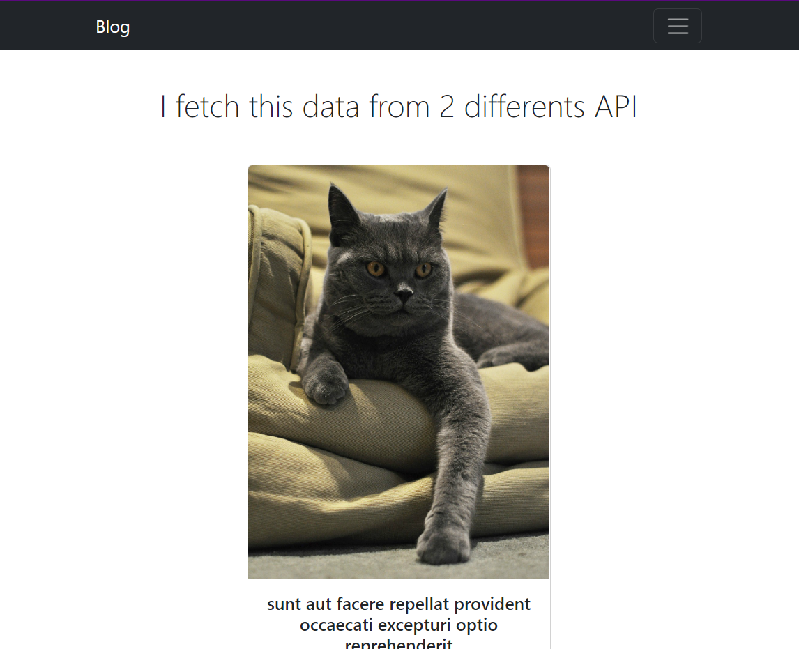

# Blog test 🛍️

I made this "blog" just to improve my knowledge about React + TS + Redux + Redux Thunks. I didn't pay attention to the design.

## Demo 🖥️

## Made with 🛠️

- [React.js](https://react.org/) - React
- [React Router Dom](https://reactrouter.com/en/v6.3.0) - React Router.
- [Css](https://react-bootstrap.github.io/) - Css Bootstrap.
- [Webpack](https://rometools.github.io/rome/) - dependencies
- [Typescript](https://www.typescriptlang.org/) - TypeScript is a strongly typed programming language that builds on JavaScript, giving you better tooling at any scale.
- [Redux - Redux Toolkit](https://redux-toolkit.js.org/) - The official, opinionated, batteries-included toolset for efficient Redux development

---
